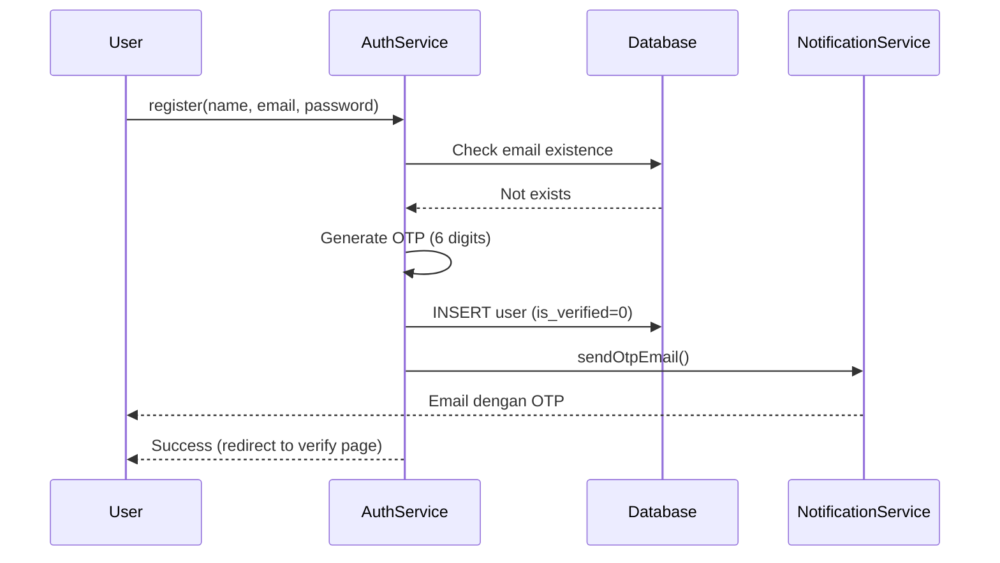
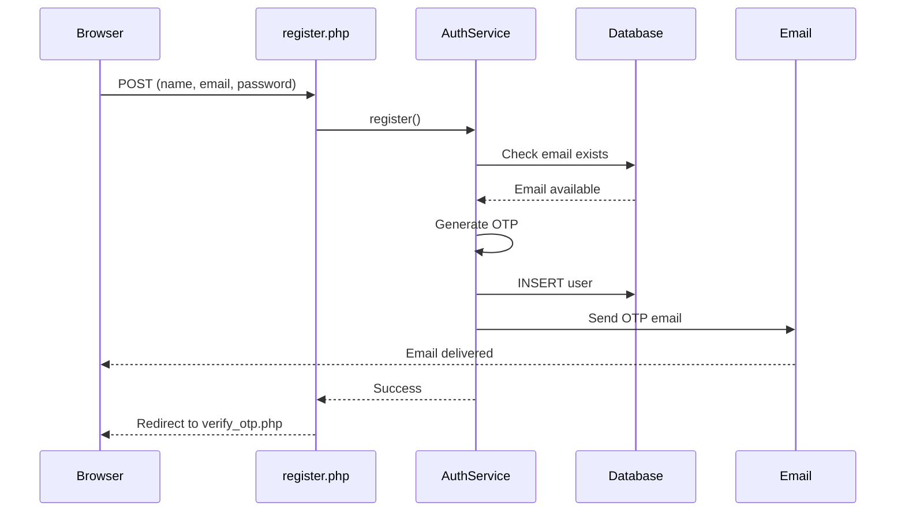
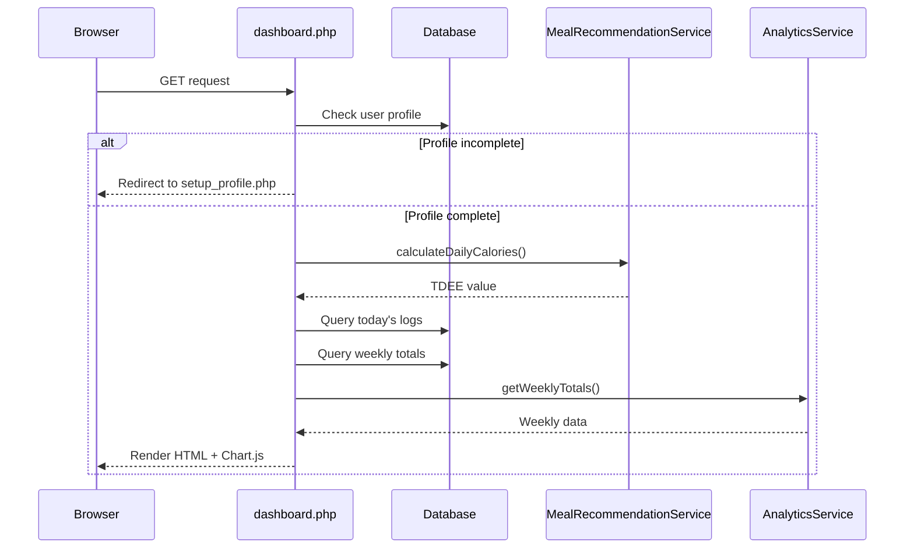
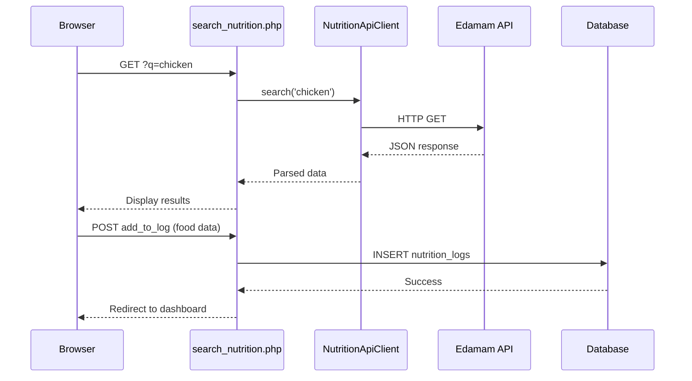
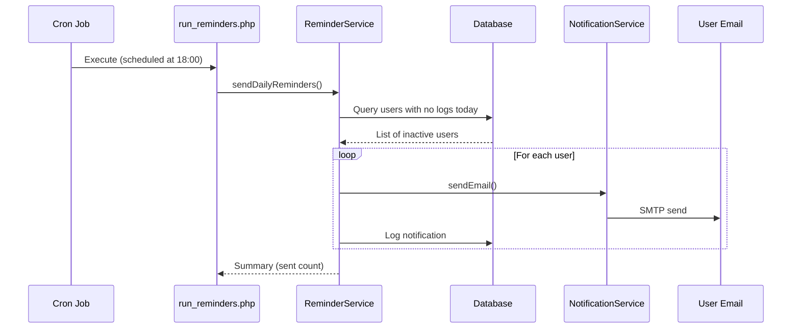
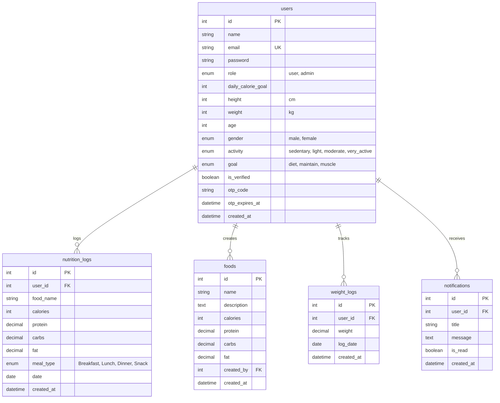

# 📘 Dokumentasi Lengkap Arsitektur Backend & Frontend SmartHealthy

> **SmartHealthy** adalah platform berbasis web untuk tracking nutrisi dan manajemen kesehatan dengan perhitungan kalori otomatis berbasis TDEE (Total Daily Energy Expenditure).

---

## 📑 Daftar Isi

1. [Ringkasan Arsitektur](#-ringkasan-arsitektur)
2. [Backend Architecture](#-backend-architecture)
3. [Frontend Architecture](#-frontend-architecture)
4. [Flow Integrasi Backend-Frontend](#-flow-integrasi-backend-frontend)
5. [Database Schema](#-database-schema)
6. [API & External Services](#-api--external-services)

---

## 🏗 Ringkasan Arsitektur

### **Tech Stack**
- **Backend**: PHP 8.0+ (Native OOP, Namespace)
- **Database**: MySQL/MariaDB
- **Frontend**: HTML5, CSS3, Vanilla JavaScript
- **Libraries**: 
  - Chart.js (visualisasi data)
  - PHPMailer (email notification)
  - Composer (dependency management)
- **External API**: Edamam Nutrition API

### **Pola Arsitektur**
- **MVC Pattern** (Model-View-Controller)
- **Service Layer Pattern** (Business logic separation)
- **Repository Pattern** (Data access abstraction)
- **Dependency Injection** (Database connection)

### **Struktur Folder**
```
yourproject/
├── bootstrap.php              # App initialization & environment loader
├── public/                    # Web server root (Frontend)
│   ├── admin/                 # Admin panel pages
│   ├── foods/                 # Food management pages  
│   ├── cron/                  # Scheduled tasks/automation
│   ├── dashboard.php          # Main user dashboard
│   ├── analytics.php          # Analytics & charts
│   ├── login.php              # Authentication
│   └── dashboard.css          # Main stylesheet
├── src/                       # Backend logic
│   ├── Config/                # Configuration classes
│   │   └── Database.php       # MySQL connection wrapper
│   ├── Models/                # Data access layer
│   │   ├── User.php
│   │   ├── Food.php
│   │   ├── NutritionLog.php
│   │   └── Notification.php
│   └── Services/              # Business logic layer
│       ├── AuthService.php
│       ├── MealRecommendationService.php
│       ├── AnalyticsService.php
│       ├── NotificationService.php
│       ├── ReminderService.php
│       ├── EmailTemplateService.php
│       ├── NutritionApiClient.php
│       └── RecommendationService.php
├── uploads/                   # User-uploaded files
├── storage/                   # Temp files & cache
└── vendor/                    # Composer dependencies
```

### **Visual Architecture Diagrams**

#### Backend Architecture


#### Frontend Structure


---

## 🔧 Backend Architecture

### 1. **Initialization Layer** (`bootstrap.php`)

#### **Fungsi Utama:**
- Load Composer autoloader
- Parse `.env` file untuk konfigurasi
- Set timezone (Asia/Jakarta)
- Populate environment variables ke `$_ENV`, `$_SERVER`, dan `putenv()`

#### **Environment Variables:**
```env
DB_HOST=127.0.0.1
DB_USER=root
DB_PASS=
DB_NAME=healthy_food_app
DB_PORT=3306

SMTP_HOST=smtp.gmail.com
SMTP_PORT=587
SMTP_USER=your-email@gmail.com
SMTP_PASS=your-app-password

API_KEY=edamam-api-key
API_ID=edamam-app-id
```

---

### 2. **Configuration Layer** (`src/Config/`)

#### **Database.php**
```php
namespace App\Config;

class Database {
    public $conn; // mysqli instance
    
    public function __construct() {
        $host = getenv('DB_HOST') ?: '127.0.0.1';
        $user = getenv('DB_USER') ?: 'root';
        $pass = getenv('DB_PASS') ?: '';
        $name = getenv('DB_NAME') ?: 'healthy_food_app';
        $port = getenv('DB_PORT') ?: 3306;
        
        $this->conn = new \mysqli($host, $user, $pass, $name, (int)$port);
        
        if ($this->conn->connect_error) {
            die("DB Error: " . $this->conn->connect_error);
        }
        
        $this->conn->set_charset("utf8mb4");
    }
}
```

**Fitur:**
- ✅ Singleton pattern (satu koneksi untuk semua request)
- ✅ Environment-based configuration
- ✅ UTF-8 encoding support
- ✅ Error handling

---

### 3. **Model Layer** (`src/Models/`)

Models bertanggung jawab untuk **data access** dan **CRUD operations**.

#### **User.php**
```php
namespace App\Models;

class User {
    private $db; // mysqli connection
    
    public function __construct(Database $db) {
        $this->db = $db->conn;
    }
    
    // Find user by email (untuk login)
    public function findByEmail($email) {
        $stmt = $this->db->prepare("SELECT * FROM users WHERE email = ?");
        $stmt->bind_param("s", $email);
        $stmt->execute();
        return $stmt->get_result()->fetch_assoc();
    }
    
    // Find user by ID (untuk session validation)
    public function findById($id) {
        $stmt = $this->db->prepare("SELECT * FROM users WHERE id = ?");
        $stmt->bind_param("i", $id);
        $stmt->execute();
        return $stmt->get_result()->fetch_assoc();
    }
}
```

**Fitur:**
- ✅ Prepared statements (SQL injection protection)
- ✅ Type hinting untuk dependency injection
- ✅ Simple API untuk query umum

#### **Food.php**
```php
namespace App\Models;

class Food {
    private $db;
    
    public function all() { ... }                        // Get all foods
    public function find($id) { ... }                    // Get food by ID
    public function create(...) { ... }                  // Insert new food
    public function update($id, ...) { ... }             // Update food
    public function delete($id) { ... }                  // Delete food
}
```

**Tabel `foods`:**
| Kolom | Tipe | Keterangan |
|-------|------|------------|
| `id` | INT (PK) | Auto increment |
| `name` | VARCHAR(255) | Nama makanan |
| `description` | TEXT | Deskripsi |
| `calories` | INT | Kalori per porsi |
| `protein` | DECIMAL | Protein (gram) |
| `carbs` | DECIMAL | Karbohidrat (gram) |
| `fat` | DECIMAL | Lemak (gram) |
| `created_by` | INT (FK) | User ID yang menambahkan |

#### **NutritionLog.php**
```php
namespace App\Models;

class NutritionLog {
    public function addLog($user_id, $food, $calories, $mealType = 'Snack') {
        $stmt = $this->db->prepare("
            INSERT INTO nutrition_logs 
            (user_id, food_name, calories, meal_type, date)
            VALUES (?, ?, ?, ?, CURDATE())
        ");
        $stmt->bind_param("isss", $user_id, $food, $calories, $mealType);
        return $stmt->execute();
    }
    
    public function getWeekly($user_id) {
        // Get aggregated weekly data
    }
}
```

**Tabel `nutrition_logs`:**
| Kolom | Tipe | Keterangan |
|-------|------|------------|
| `id` | INT (PK) | Auto increment |
| `user_id` | INT (FK) | Pemilik log |
| `food_name` | VARCHAR(255) | Nama makanan (snapshot) |
| `calories` | INT | Kalori tercatat |
| `protein` | DECIMAL | Protein (gram) |
| `carbs` | DECIMAL | Karbohidrat (gram) |
| `fat` | DECIMAL | Lemak (gram) |
| `meal_type` | ENUM | `Breakfast`, `Lunch`, `Dinner`, `Snack` |
| `date` | DATE | Tanggal pencatatan |

---

### 4. **Service Layer** (`src/Services/`)

Services mengandung **business logic** dan **complex operations**.

#### **AuthService.php**

**Tanggung Jawab:**
- User registration dengan OTP verification
- Login dengan password verification
- OTP resend & validation
- Email notification untuk verifikasi akun

**Methods:**
```php
class AuthService {
    public function register($name, $email, $password) {
        // 1. Check if email exists
        // 2. Hash password
        // 3. Generate 6-digit OTP
        // 4. Insert user dengan status is_verified=0
        // 5. Send OTP via email
        // Return: true/false
    }
    
    public function login($email, $password) {
        // 1. Find user by email
        // 2. Verify password hash
        // 3. Check is_verified status
        // Return: user array / 'unverified' / false
    }
    
    public function verifyOtp($email, $otp) {
        // 1. Validate OTP code
        // 2. Check expiration (15 minutes)
        // 3. Update is_verified=1
        // Return: true / error message
    }
}
```

**Flow Registration:**


#### **MealRecommendationService.php**

**Tanggung Jawab:**
- Menghitung TDEE berdasarkan rumus **Mifflin-St Jeor**
- Generate meal plan harian (Breakfast, Lunch, Dinner)
- Adjust kalori berdasarkan goal (diet/maintain/muscle)

**Methods:**
```php
class MealRecommendationService {
    public function calculateDailyCalories($userId) {
        // 1. Get user profile (height, weight, age, gender, activity)
        // 2. Calculate BMR = 10*weight + 6.25*height - 5*age + s
        //    s = +5 (male), -161 (female)
        // 3. Calculate TDEE = BMR * activity_multiplier
        //    - Sedentary: 1.2
        //    - Light: 1.375
        //    - Moderate: 1.55
        //    - Very active: 1.725
        // 4. Adjust by goal:
        //    - Diet: TDEE - 500
        //    - Muscle: TDEE + 400
        //    - Maintain: TDEE
        // 5. Update user table (daily_calorie_goal)
        // Return: calculated TDEE
    }
    
    public function getDailyRecommendation($userId) {
        // 1. Get user's TDEE and goal
        // 2. Split calories: Breakfast 30%, Lunch 40%, Dinner 30%
        // 3. Query foods dari database yang match calorie range
        // 4. Prioritize high-protein foods untuk goal=muscle
        // 5. Avoid duplicate foods
        // Return: array of meals
    }
    
    public function generateDailyPlan($userId, $date) {
        // 1. Generate recommendation
        // 2. Save to nutrition_logs table
        // Return: saved plan
    }
}
```

**Rumus Mifflin-St Jeor:**
```
BMR (Pria)   = 10*W + 6.25*H - 5*A + 5
BMR (Wanita) = 10*W + 6.25*H - 5*A - 161

TDEE = BMR × Activity Factor

Activity Factors:
- Sedentary (little/no exercise): 1.2
- Light (1-3 days/week): 1.375
- Moderate (3-5 days/week): 1.55
- Very Active (6-7 days/week): 1.725
```

#### **AnalyticsService.php**

**Tanggung Jawab:**
- Aggregate data untuk dashboard analytics
- Weekly trends (kalori, makronutrisi)
- Top foods tracking
- History logging

**Methods:**
```php
class AnalyticsService {
    public function getWeeklyTotals($userId) {
        // Query: GROUP BY date
        // Return: [{date, cal, protein, carbs, fat}, ...]
    }
    
    public function getTopFoods($userId, $limit=5) {
        // Query most logged foods
        // Return: [{food_name, count}, ...]
    }
    
    public function getHistory($userId, $limit=20) {
        // Get recent logs ordered by date DESC
    }
}
```

#### **NotificationService.php**

**Tanggung Jawab:**
- Send email via PHPMailer
- SMTP configuration
- Email templating

**Methods:**
```php
class NotificationService {
    public function sendEmail($to, $subject, $body, $isPlain=false, $isHtml=true) {
        // 1. Configure PHPMailer with SMTP
        // 2. Set sender, recipient, subject
        // 3. Set message body (HTML/plain)
        // 4. Send email
        // Return: true/false
    }
}
```

**SMTP Configuration:**
```php
$mail->isSMTP();
$mail->Host = 'smtp.gmail.com';
$mail->SMTPAuth = true;
$mail->Username = getenv('SMTP_USER');
$mail->Password = getenv('SMTP_PASS'); // App Password
$mail->SMTPSecure = PHPMailer::ENCRYPTION_STARTTLS;
$mail->Port = 587;
```

#### **ReminderService.php**

**Tanggung Jawab:**
- Deteksi user yang belum log makanan hari ini
- Send daily reminder email
- Meal-specific reminders (breakfast/lunch/dinner)

**Methods:**
```php
class ReminderService {
    public function sendDailyReminders() {
        // 1. Query users yang belum ada log hari ini
        // 2. Loop dan send email reminder
        // 3. Log notification to database
    }
    
    public function sendMealReminder($mealType) {
        // Send reminder berdasarkan waktu:
        // - Breakfast: 07:00
        // - Lunch: 12:00
        // - Dinner: 18:00
    }
}
```

#### **NutritionApiClient.php**

**Tanggung Jawab:**
- Integrasi dengan Edamam Nutrition API
- Search makanan real-time
- Parse API response

**Methods:**
```php
class NutritionApiClient {
    public function search($query) {
        // 1. Build API URL dengan query & credentials
        // 2. Make HTTP request (file_get_contents / cURL)
        // 3. Parse JSON response
        // 4. Extract calories, protein, carbs, fat
        // Return: array of foods
    }
}
```

---

## 💻 Frontend Architecture

### 1. **Page Structure**

Frontend menggunakan **server-side rendering** (PHP generates HTML).

#### **Landing Page** (`index.php`)
- Marketing page / redirect ke login

#### **Authentication Pages**
- [login.php](file:///c:/xampp/htdocs/yourproject/public/login.php) - Login form
- [register.php](file:///c:/xampp/htdocs/yourproject/public/register.php) - Registration form
- [verify_otp.php](file:///c:/xampp/htdocs/yourproject/public/verify_otp.php) - OTP verification
- [forgot_password.php](file:///c:/xampp/htdocs/yourproject/public/forgot_password.php) - Password reset request
- [reset_password.php](file:///c:/xampp/htdocs/yourproject/public/reset_password.php) - Password reset form

#### **User Dashboard Pages**
- [dashboard.php](file:///c:/xampp/htdocs/yourproject/public/dashboard.php) - Main hub dengan:
  - Today's calorie intake vs target
  - Weekly chart (Chart.js line chart)
  - Today's food log table
  - Health warnings (surplus, high carbs, low protein)
  - Weight tracker (untuk goal=diet/muscle)
  
- [analytics.php](file:///c:/xampp/htdocs/yourproject/public/analytics.php) - Advanced analytics:
  - Weekly trends chart
  - Macronutrient distribution (pie chart)
  - Top logged foods
  - Export to CSV

- [meal_plan.php](file:///c:/xampp/htdocs/yourproject/public/meal_plan.php) - AI meal recommendations:
  - Generate daily plan
  - Preview recommendations
  - Apply to food diary

- [search_nutrition.php](file:///c:/xampp/htdocs/yourproject/public/search_nutrition.php) - Food search:
  - Real-time search via Edamam API
  - Display nutrition facts
  - Add to today's log

- [profile.php](file:///c:/xampp/htdocs/yourproject/public/profile.php) - User settings:
  - Personal metrics (height, weight, age, gender)
  - Activity level
  - Fitness goal (diet/maintain/muscle)
  - TDEE calculation

- [calendar.php](file:///c:/xampp/htdocs/yourproject/public/calendar.php) - Historical view
- [weight_tracker.php](file:///c:/xampp/htdocs/yourproject/public/weight_tracker.php) - Weight logging
- [notifications.php](file:///c:/xampp/htdocs/yourproject/public/notifications.php) - Notification center

#### **Food Management** (`foods/`)
- [foods/index.php](file:///c:/xampp/htdocs/yourproject/public/foods/index.php) - Browse foods
- [foods/create.php](file:///c:/xampp/htdocs/yourproject/public/foods/create.php) - Add custom food
- [foods/edit.php](file:///c:/xampp/htdocs/yourproject/public/foods/edit.php) - Edit food
- [foods/delete.php](file:///c:/xampp/htdocs/yourproject/public/foods/delete.php) - Delete food (admin only)

#### **Admin Panel** (`admin/`)
- [admin/dashboard.php](file:///c:/xampp/htdocs/yourproject/public/admin/dashboard.php) - Admin overview:
  - User statistics
  - System health
  - Quick actions (trigger reminders)
  
- [admin/users.php](file:///c:/xampp/htdocs/yourproject/public/admin/users.php) - User management (CRUD)
- [admin/foods.php](file:///c:/xampp/htdocs/yourproject/public/admin/foods.php) - Global food database
- [admin/categories.php](file:///c:/xampp/htdocs/yourproject/public/admin/categories.php) - Food categories
- [admin/api_logs.php](file:///c:/xampp/htdocs/yourproject/public/admin/api_logs.php) - API usage tracking
- [admin/reports.php](file:///c:/xampp/htdocs/yourproject/public/admin/reports.php) - Analytics reports
- [admin/test_reminder.php](file:///c:/xampp/htdocs/yourproject/public/admin/test_reminder.php) - Test email system

---

### 2. **UI Components & Styling**

#### **[dashboard.css](file:///c:/xampp/htdocs/yourproject/public/dashboard.css)** - Main Stylesheet

**CSS Architecture:**
```css
/* 1. CSS Variables (Design Tokens) */
:root {
    --blue: #3b82f6;
    --green: #10b981;
    --red: #ef4444;
    --yellow: #f59e0b;
    --purple: #8b5cf6;
    
    --bg-primary: #f9fafb;
    --bg-card: #ffffff;
    --text-primary: #1f2937;
    --text-secondary: #6b7280;
    
    --font-primary: 'Inter', sans-serif;
}

/* 2. Layout Components */
.topbar { /* Sticky navigation */ }
.container { /* Max-width wrapper */ }
.grid-2, .grid-3 { /* Responsive grid layouts */ }

/* 3. Card Components */
.card {
    background: var(--bg-card);
    border-radius: 12px;
    box-shadow: 0 1px 3px rgba(0,0,0,0.1);
}

/* 4. Data Visualization */
.chart-container { /* Chart.js wrapper */ }
.stat-item { /* Metric display */ }

/* 5. Interactive Elements */
.btn-primary, .btn-secondary { /* Buttons */ }
.form-input { /* Form controls */ }
```

**Design Principles:**
- ✅ Mobile-first responsive design
- ✅ Consistent spacing (8px grid system)
- ✅ Accessible color contrast (WCAG AA)
- ✅ Smooth transitions & hover states
- ✅ Loading states & error handling

---

### 3. **JavaScript & Interactivity**

#### **Chart.js Integration** (Dashboard & Analytics)

**Line Chart - Daily Calorie Trend:**
```javascript
// In dashboard.php
const ctx = document.getElementById('weeklyChart').getContext('2d');
const chart = new Chart(ctx, {
    type: 'line',
    data: {
        labels: ['Mon', 'Tue', 'Wed', 'Thu', 'Fri', 'Sat', 'Sun'],
        datasets: [{
            label: 'Actual Intake',
            data: [1800, 2200, 1950, 2100, 1700, 2300, 2000],
            borderColor: 'rgb(59, 130, 246)',
            tension: 0.4
        }, {
            label: 'Target',
            data: [2000, 2000, 2000, 2000, 2000, 2000, 2000],
            borderColor: 'rgb(239, 68, 68)',
            borderDash: [5, 5]
        }]
    },
    options: {
        responsive: true,
        maintainAspectRatio: false,
        plugins: {
            legend: { position: 'top' },
            tooltip: { mode: 'index' }
        }
    }
});
```

**Pie Chart - Macronutrient Distribution:**
```javascript
// In analytics.php
const pieCtx = document.getElementById('macroChart').getContext('2d');
const pieChart = new Chart(pieCtx, {
    type: 'doughnut',
    data: {
        labels: ['Protein', 'Carbs', 'Fat'],
        datasets: [{
            data: [<?= $weekProtein ?>, <?= $weekCarbs ?>, <?= $weekFat ?>],
            backgroundColor: [
                'rgb(16, 185, 129)',  // Green
                'rgb(251, 191, 36)',  // Yellow
                'rgb(239, 68, 68)'    // Red
            ]
        }]
    },
    options: {
        responsive: true,
        plugins: {
            legend: { position: 'bottom' }
        }
    }
});
```

#### **Form Validation** (Client-side)
```javascript
// Registration form validation
document.getElementById('registerForm').addEventListener('submit', function(e) {
    const email = document.getElementById('email').value;
    const password = document.getElementById('password').value;
    
    if (!email.includes('@')) {
        e.preventDefault();
        alert('Email harus valid');
    }
    
    if (password.length < 6) {
        e.preventDefault();
        alert('Password minimal 6 karakter');
    }
});
```

#### **AJAX Requests** (Search & Dynamic Updates)
```javascript
// Real-time food search
async function searchFood(query) {
    const response = await fetch(`search_nutrition.php?q=${query}`);
    const data = await response.json();
    
    displayResults(data.foods);
}

// Debounced search
let searchTimeout;
document.getElementById('searchInput').addEventListener('input', function(e) {
    clearTimeout(searchTimeout);
    searchTimeout = setTimeout(() => {
        searchFood(e.target.value);
    }, 500); // Wait 500ms after typing stops
});
```

---

## 🔄 Flow Integrasi Backend-Frontend

### **1. User Registration Flow**



### **2. Dashboard Load Flow**



### **3. Food Search & Add Flow**



### **4. Daily Reminder Automation**



---

## 💾 Database Schema

### **Entity Relationship Diagram (ERD)**



### **Tabel Users - Detail**

**Primary Functions:**
- Authentication (email + password)
- Profile storage (metrics untuk TDEE)
- Role management (user vs admin)
- OTP verification

**Key Columns:**
- `daily_calorie_goal` - Auto-calculated oleh `MealRecommendationService`
- `goal` - Determines calorie adjustment (±500 kcal)
- `activity` - Activity multiplier (1.2 - 1.725)
- `is_verified` - Email verification status

### **Tabel Nutrition_Logs - Detail**

**Primary Functions:**
- Store daily food intake
- Track macronutrients
- Enable analytics & reporting

**Key Columns:**
- `food_name` - Snapshot (not FK) untuk historical accuracy
- `meal_type` - Time-based categorization
- `date` - Partitioning key untuk queries

**Indexes:**
```sql
CREATE INDEX idx_user_date ON nutrition_logs(user_id, date);
CREATE INDEX idx_date ON nutrition_logs(date);
```

### **Tabel Foods - Detail**

**Primary Functions:**
- Global food database
- User-created custom foods
- Meal plan source data

**Key Columns:**
- `created_by` - NULL = system food, INT = user-created

---

## 🌐 API & External Services

### **1. Edamam Nutrition API**

**Base URL:** `https://api.edamam.com/api/nutrition-data`

**Authentication:**
- `app_id` - Application ID
- `app_key` - API Key

**Request Example:**
```
GET https://api.edamam.com/api/nutrition-data?
    app_id=YOUR_APP_ID&
    app_key=YOUR_APP_KEY&
    ingr=100g%20chicken%20breast
```

**Response Format:**
```json
{
  "calories": 165,
  "totalNutrients": {
    "PROCNT": { "quantity": 31, "unit": "g" },
    "CHOCDF": { "quantity": 0, "unit": "g" },
    "FAT": { "quantity": 3.6, "unit": "g" }
  }
}
```

**Usage in Code:**
```php
// src/Services/NutritionApiClient.php
public function search($query) {
    $appId = getenv('API_ID');
    $appKey = getenv('API_KEY');
    $url = "https://api.edamam.com/api/nutrition-data?";
    $url .= "app_id={$appId}&app_key={$appKey}&ingr=" . urlencode($query);
    
    $response = file_get_contents($url);
    $data = json_decode($response, true);
    
    return [
        'calories' => $data['calories'] ?? 0,
        'protein' => $data['totalNutrients']['PROCNT']['quantity'] ?? 0,
        'carbs' => $data['totalNutrients']['CHOCDF']['quantity'] ?? 0,
        'fat' => $data['totalNutrients']['FAT']['quantity'] ?? 0
    ];
}
```

### **2. SMTP Email Service (Gmail)**

**Configuration:**
- Host: `smtp.gmail.com`
- Port: `587` (TLS) atau `465` (SSL)
- Authentication: Required
- Credentials: Email + **App Password** (bukan password login)

**PHPMailer Setup:**
```php
// src/Services/NotificationService.php
use PHPMailer\PHPMailer\PHPMailer;

public function sendEmail($to, $subject, $body) {
    $mail = new PHPMailer(true);
    
    $mail->isSMTP();
    $mail->Host = 'smtp.gmail.com';
    $mail->SMTPAuth = true;
    $mail->Username = getenv('SMTP_USER');
    $mail->Password = getenv('SMTP_PASS');
    $mail->SMTPSecure = PHPMailer::ENCRYPTION_STARTTLS;
    $mail->Port = 587;
    
    $mail->setFrom(getenv('SMTP_USER'), 'SmartHealthy');
    $mail->addAddress($to);
    $mail->isHTML(true);
    $mail->Subject = $subject;
    $mail->Body = $body;
    
    return $mail->send();
}
```

**Email Templates:**
- OTP Verification (`AuthService`)
- Daily Reminder (`ReminderService`)
- Meal Reminder (`ReminderService`)
- Password Reset (`AuthService`)

---

## 🔐 Security Features

### **1. Authentication & Authorization**

**Password Security:**
```php
// Hashing saat register
$hash = password_hash($password, PASSWORD_DEFAULT);

// Verification saat login
if (password_verify($input, $user['password'])) {
    // Login success
}
```

**Session Management:**
```php
session_start();
$_SESSION['user'] = [
    'id' => $user['id'],
    'name' => $user['name'],
    'email' => $user['email'],
    'role' => $user['role']
];
```

**Role-Based Access Control:**
```php
// admin/dashboard.php
if (!isset($_SESSION['user']) || $_SESSION['user']['role'] !== 'admin') {
    header("Location: ../login.php");
    exit;
}
```

### **2. SQL Injection Prevention**

**Prepared Statements:**
```php
// ✅ SECURE
$stmt = $db->prepare("SELECT * FROM users WHERE email = ?");
$stmt->bind_param("s", $email);

// ❌ VULNERABLE
$result = $db->query("SELECT * FROM users WHERE email = '$email'");
```

### **3. XSS Protection**

**Output Escaping:**
```php
// In PHP views
<?= htmlspecialchars($user['name'], ENT_QUOTES, 'UTF-8') ?>
```

### **4. CSRF Protection**

**Token Generation:**
```php
// Generate CSRF token
if (!isset($_SESSION['csrf_token'])) {
    $_SESSION['csrf_token'] = bin2hex(random_bytes(32));
}

// In form
<input type="hidden" name="csrf_token" value="<?= $_SESSION['csrf_token'] ?>">

// Validation
if ($_POST['csrf_token'] !== $_SESSION['csrf_token']) {
    die('Invalid CSRF token');
}
```

---

## 📊 Performance Optimization

### **1. Database Optimization**

**Indexes:**
```sql
-- Speed up user lookups
CREATE INDEX idx_email ON users(email);

-- Speed up log queries
CREATE INDEX idx_user_date ON nutrition_logs(user_id, date);

-- Speed up analytics
CREATE INDEX idx_date ON nutrition_logs(date);
```

**Query Optimization:**
```php
// ✅ GOOD: Aggregate di database
SELECT SUM(calories) FROM nutrition_logs WHERE user_id = ? AND date = ?

// ❌ BAD: Fetch all then sum in PHP
SELECT calories FROM nutrition_logs WHERE user_id = ?
```

### **2. Caching Strategies**

**Session Caching:**
```php
// Cache user's TDEE in session
if (!isset($_SESSION['user']['tdee'])) {
    $service = new MealRecommendationService();
    $_SESSION['user']['tdee'] = $service->calculateDailyCalories($user_id);
}
```

### **3. Frontend Optimization**

**CDN Usage:**
```html
<!-- Load Chart.js from CDN -->
<script src="https://cdn.jsdelivr.net/npm/chart.js"></script>
```

**Lazy Loading:**
```javascript
// Load charts only when tab is active
document.addEventListener('DOMContentLoaded', function() {
    if (document.getElementById('weeklyChart')) {
        initChart();
    }
});
```

---

## 🚀 Deployment Checklist

### **Development Environment**
- ✅ XAMPP/WAMP local server
- ✅ Composer installed
- ✅ `.env` configured
- ✅ Database created & migrated

### **Production Environment**
- ✅ PHP 8.0+
- ✅ MySQL 5.7+ / MariaDB
- ✅ HTTPS enabled
- ✅ `.env` dengan production credentials
- ✅ Cron jobs configured:
  ```bash
  # Daily reminder (18:00)
  0 18 * * * php /path/to/public/cron/run_reminders.php
  
  # Meal reminders
  0 7 * * * php /path/to/public/cron/run_meal_reminder.php breakfast
  0 12 * * * php /path/to/public/cron/run_meal_reminder.php lunch
  0 18 * * * php /path/to/public/cron/run_meal_reminder.php dinner
  ```
- ✅ File permissions:
  ```bash
  chmod 755 public/
  chmod 777 uploads/
  chmod 777 storage/
  ```
- ✅ Error logging enabled
- ✅ Backup strategy implemented

---

## 📝 Kesimpulan

### **Backend Highlights:**
1. **Modular Architecture** - Service layer terpisah dari models
2. **Security First** - Prepared statements, password hashing, session management
3. **Business Logic** - TDEE calculation, meal recommendations, analytics
4. **Automation** - Daily reminders via cron + email
5. **External Integration** - Edamam API untuk nutrition data

### **Frontend Highlights:**
1. **Server-Side Rendering** - PHP generates HTML (SEO-friendly)
2. **Data Visualization** - Chart.js untuk trends & analytics
3. **Responsive Design** - Mobile-first CSS
4. **Progressive Enhancement** - Works without JS, enhanced with JS
5. **User Experience** - Real-time search, form validation, loading states

### **Key Technologies:**
- **Backend**: PHP 8.0 (OOP), MySQL, PHPMailer, Composer
- **Frontend**: HTML5, CSS3 (Custom), JavaScript (Vanilla), Chart.js
- **APIs**: Edamam Nutrition API, Gmail SMTP
- **Tools**: XAMPP, Git, Cron

### **Development Principles:**
- ✅ Separation of Concerns (MVC + Service Layer)
- ✅ DRY (Don't Repeat Yourself)
- ✅ Security by Design
- ✅ Performance Optimization
- ✅ User-Centric Design

---

**🎯 SmartHealthy** adalah contoh aplikasi web modern yang menggabungkan backend logic yang solid dengan frontend yang user-friendly, menghasilkan platform tracking nutrisi yang powerful dan mudah digunakan.
